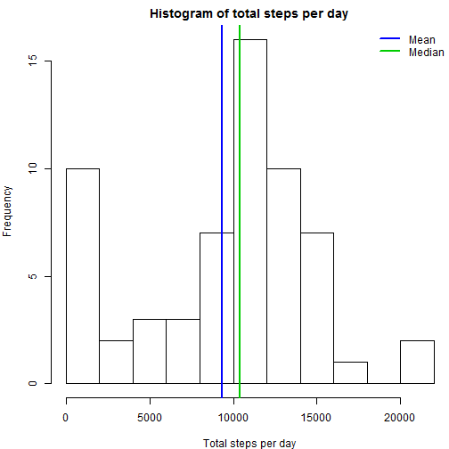
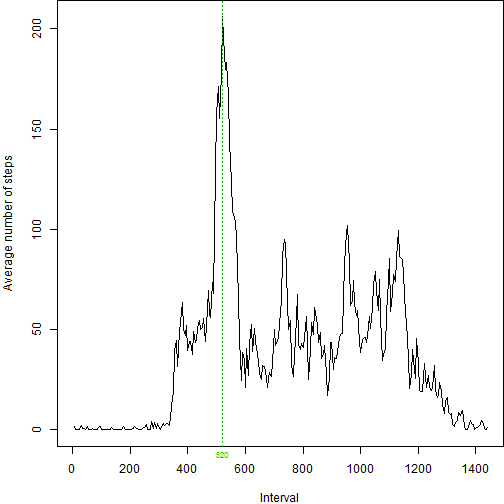
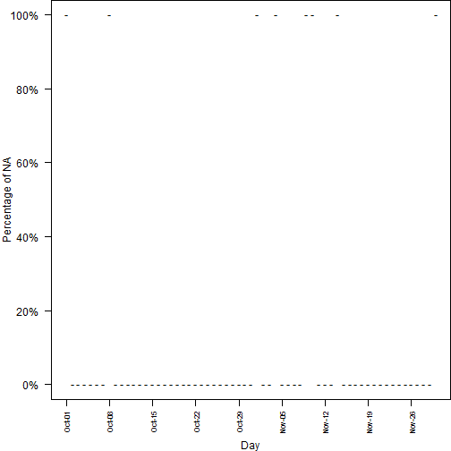
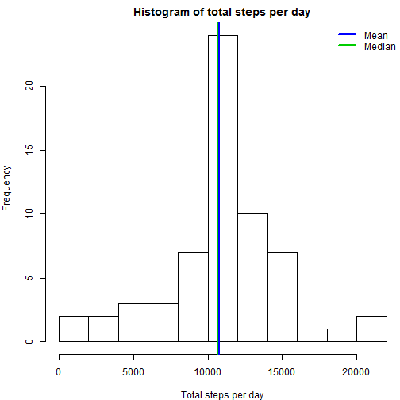
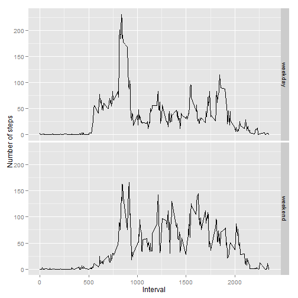

# Assignment 1

### Loading and preprocessing the data

First let's extract data from archive and load it.

```r
#download.file("https://d396qusza40orc.cloudfront.net/repdata%2Fdata%2Factivity.zip", destfile="activity.zip")
unzip("activity.zip")
data <- read.csv("activity.csv")
```
  
### What is mean total number of steps taken per day?

Now let's calculate total number of steps per day, its mean and median.

```r
total_steps_p_day <- tapply(data$steps, data$date, sum, na.rm=TRUE)
cmean <- mean(total_steps_p_day)
cmedian <- median(total_steps_p_day)
```

Here we create histogram.

```r
old <- par(mar=c(4,4,2,0))
hist(total_steps_p_day, breaks=10, main='Histogram of total steps per day', xlab='Total steps per day')
abline(v=c(cmean, cmedian), col=4:3, lwd=2)
legend('topright', c('Mean', 'Median'), col=4:3, bty='n', lwd=2)
```

 

```r
par(old)
```
Observed mean of total steps by day is 9354.2295 and median is equal to 10395.
  
### What is the average daily activity pattern?

Below we can see time series plot that answers that question.

```r
old <- par(mar=c(4,4,0,0))
mean_by_interval <- tapply(data$steps, data$interval, mean, na.rm=TRUE)
plot(mean_by_interval, xaxt='n', xlab='Interval', ylab='Average number of steps', type='l')
axis(1, pretty(5*(seq_along(mean_by_interval)-1),8)/5, pretty(5*(seq_along(mean_by_interval)-1),8))
abline(v=which.max(mean_by_interval), col=3, lty=3)
max_n_steps <- which.max(mean_by_interval) *5
mtext(max_n_steps, at=which.max(mean_by_interval), side=1, col=3, cex=.7)
```

 

```r
par(old)
```

As we can see 520 interval contains maximum number of steps at average.

### Imputing missing values

Let's start with counting missing values.


```r
n_na <- sum(is.na(data$steps))
na_by_day <- tapply(data$steps, data$date, function(x)sum(is.na(x))/length(x))
days <- sum(na_by_day==1)
```

There are 2304 missing values in our data set. What is more interesting there are 8 days without any information about number of steps.

```r
old <- par(mar=c(4,4,0,0))
plot(na_by_day, pch='-', xlab='Day', ylab='Percentage of NA', xaxt='n', yaxt='n')
axis(1, seq(1,length(na_by_day),7), format(as.Date(names(na_by_day)), '%b-%d')[seq(1,length(na_by_day),7)], cex.axis=.7, las=2, srt=45)
axis(2, seq(0,1,.2), paste0(seq(0,1,.2)*100, '%'), las=2)
```

 

```r
par(old)
```

We will fill missing values with mean value of a given interval.

```r
data_imp <- data
mean_by_interval <- tapply(data$steps, data$interval, mean, na.rm=TRUE)
for(int in names(mean_by_interval))
{
  data_imp[data_imp$interval==int & is.na(data_imp$steps), 'steps'] <- floor(mean_by_interval[int])
}
```

Below we can see histogram of the total number of steps taken each day.

```r
total_steps_p_day_imp <- tapply(data_imp$steps, data_imp$date, sum, na.rm=TRUE)
cmean_imp <- mean(total_steps_p_day_imp)
cmedian_imp <- median(total_steps_p_day_imp)
old <- par(mar=c(4,4,2,0))
hist(total_steps_p_day_imp, breaks=10, main='Histogram of total steps per day', xlab='Total steps per day')
abline(v=c(cmean_imp, cmedian_imp), col=4:3, lwd=2)
legend('topright', c('Mean', 'Median'), col=4:3, bty='n', lwd=2)
```

 

```r
par(old)
```

Now observed mean of total steps by day is 10749.7705 and median is equal to 10641.
Of course these values differ from previous results and cause increase in total daily number of steps.

### Are there differences in activity patterns between weekdays and weekends?

We will start with creating new factor variable indicating if a given day is a weekday or a weekend.

```r
day_end <- ifelse(weekdays(as.Date(as.character(data$date))) %in% c('Saturday', 'Sunday'), 'weekend', 'weekday')
data_imp$Which <- day_end
```

Now let's prepare data and make a plot.

```r
ag_data <- aggregate(data_imp$steps, by=list(which=data_imp$Which, int=data_imp$interval), mean, na.rm=TRUE)
qplot(int, x, data=ag_data, facets=which~., geom='line', xlab='Interval', ylab='Number of steps')
```

 

As we can see there are visible differences. Namely during the week (weekdays) this person has made more steps in the morning (probably because of the work). In the weekend there were similar number of steps (higher than in the weekdays) during all the day.
